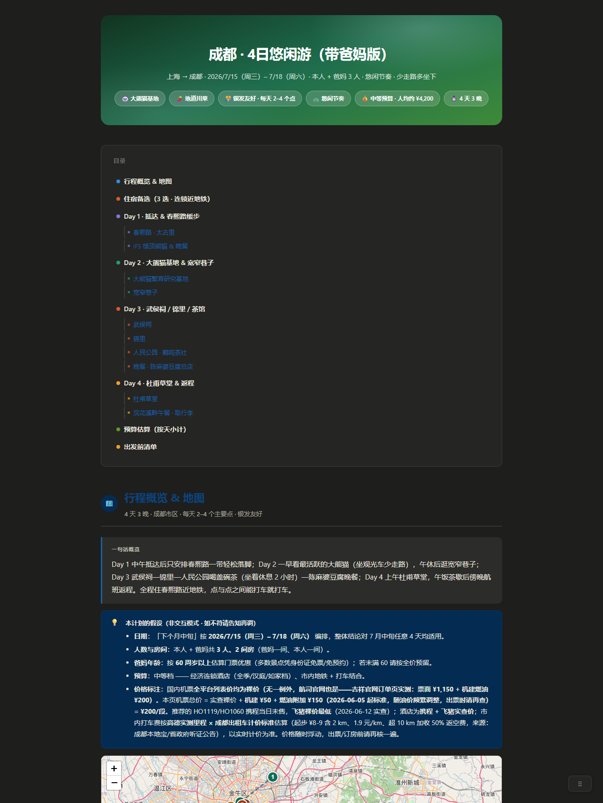

<div align="center">

# trip-planner | 查证型行程页

> *「网上抄来的攻略,会把你送到闭馆的大门口。」*

[](SKILL.md)
[](https://claude.com/claude-code)
[](LICENSE)

**把"网上抄来的攻略"变成"查证过的行程页"——单文件 HTML,带活地图、实价比价和不撒谎的营业时间。**

[看效果](#效果示例) · [安装](#快速开始) · [触发方式](#触发方式) · [和同类有什么不同](#它和同类有什么不同) · [安全边界](#安全边界)

</div>

---


<sub>真实运行产物(成都 4 日银发亲子行程),非设计稿。完整文件见 [examples/成都4日游行程.html](examples/成都4日游行程.html)。</sub>

---

## 它解决什么问题

你让 AI 排过行程吗?它会热情地给你一篇小作文:景点是真的,营业时间是编的;路线在地图上画出来是个"米"字;机票价格停留在它的训练数据里;酒店推荐抄的是商家简介,不是住客差评。

这个 skill 换了一个思路:**行程不是写出来的,是查证出来的。** 它跑一个四段工作流——先把需求 **grill 透**(沿决策树逐层追问:大交通订了没?返程几点前必须到家?证件在不在有效期?——每问附推荐答案,问到没有一项靠猜为止),再检索交通/天气/开放时间,然后逐项核对(闭馆日、赶车缓冲、日落时间),最后才组装页面。每个数字要么来自当场检索或浏览器实价,要么老老实实标「以官网为准」。机票和酒店价格走浏览器多平台实查(只读,绝不下单);酒店看的是**最近的差评**,不是头图和评分。

产出是**一个自包含 HTML 文件**:发给同行人就能用,旅途中手机离线打开,勾掉的清单项都记得住。

## 效果示例

**输入**(一句话,真实 eval prompt):

```text
下个月中旬带爸妈去成都玩4天,从上海出发,预算中等,想看大熊猫、吃地道川菜,
老人家走不动太多路,节奏悠闲点,帮我做个行程。
```

**输出**(同一次运行的三个截面):

| 逐日时间线 + 交通段卡 | 住宿备选(评论体检) | 手机端 |
|---|---|---|
|  |  |  |

注意截图里的细节:机票价是**航司官网含税总价**(OTA 列表价都是不含燃油/机建的裸价,预算用它必然失真);推荐的两班直飞(HO1119/HO1060)**携程当日没在卖**,飞猪和官网在卖且**全是裸价**(吉祥官网页头标"含税"但订单页实测仍另加 ¥200 税费)——比价必须先统一到"裸价+税费"口径;市内打车费按**高德实测里程 × 成都出租车计价标准**估算并写明来源;查不到的数字(飞猪验证码墙后的那家)如实标「未读价」。实查还推翻了一串想当然:初稿推荐的一家如家分店在携程查无此店、「华住会会员价更低」实测是迷思、"上午没有直飞"是上一版漏读官网渠道的错误结论。这就是"查证型行程页"和"写出来的攻略"的区别。

**对照实验**(2 个中文用例,同 prompt 跑 with/without skill,[完整数据](evals/benchmark.md)):

| 配置 | 自动检查 | HTML 校验 | 地图 | 主题头 | POI 四字段卡 |
|---|---|---|---|---|---|
| **with skill** | **10/10 ×2** | 全过 | ✅ | ✅ | ✅ |
| baseline(无 skill) | 5/10 ×2 | FAIL ×2 | ❌ | ❌ | ❌ |

成本如实说:with-skill 约 2× tokens 和耗时(~10 万 tokens / 7–8 分钟)——这是真检索 + 完整结构化构建的价格。

## 快速开始

```bash
git clone https://github.com/Eric6286/trip-planner ~/.claude/skills/trip-planner
```

装完对 Claude Code 说(可直接复制):

```text
国庆想去西安玩4天,从北京出发,帮我做个行程
```

无前置依赖、零 API key:地图用 Leaflet + OpenStreetMap(免 key),检索用 Agent 自带的 web search,浏览器比价在有 Chrome 连接时自动启用、没有就降级为标注过的估价。

## 触发方式

- 帮我规划行程 / 做个旅行计划 / 帮我排个行程
- 6月去东京玩5天 / 国庆想去成都4天
- 下周末杭州两日游怎么安排?
- 带爸妈去厦门,节奏慢一点,帮我做攻略
- Plan a 5-day Tokyo itinerary, flying from Shanghai
- 9月23到26号去西安,顺便看下北京出发的高铁几点有车

## 它会交付什么

一个自包含 HTML 行程页,包含:主题化渐变头部(按目的地配色)、内嵌 Leaflet 地图(逐日编号 pin + 路线)、逐日 POI 时间线卡(到达时间/停留/票价/营业时间)、点间通勤连接器(步行/地铁/打车 + 距离 + 时间)、每日花费与步数估算、交通段卡(航班/车次 + 多平台比价)、**≥3 张住宿备选卡(评论体检 + 比价,用户没提酒店也会有)**、按天小计的预算表、localStorage 出发前清单、雨天 Plan B,以及 注意/必订/避雷 callout。

## 它和同类有什么不同

| 维度 | 同类常见做法 | 本 skill |
|---|---|---|
| 地图 | 无地图,或跳转链接([ycyliu](https://github.com/ycyliu/travel-planner-skill)、[SunDaysketch](https://github.com/SunDaysketch/travel-planner-skill)),或要 API key + 本地服务器([sucr233](https://github.com/sucr233/travel_planner_skills)) | 内嵌 Leaflet + OSM,免 key,单文件离线可看 |
| 价格数据 | 硬编码在 skill 里(会过期),或模型记忆 | 浏览器多平台实查;国内机票全平台均为裸价,统一按「裸价+现查税费」口径比价;查不到就标「以官网为准」,不编 |
| 酒店推荐 | 抄商家简介和评分 | 读最近差评做「评论体检」,评论压过品牌 |
| 预订 | 部分同类可直接下单 | **只查询,永不下单/登录/过验证码**——预订永远是你自己的动作 |
| 输出验证 | 无 | 静态校验器把关:地图坐标、组件齐全、自包含,缺住宿卡直接 FAIL |

## 安全边界

- **只读不订**:永不下单、付款、占座;预订链接给你,动作你来做。
- **永不碰你的凭据**:不输密码、不解验证码/滑块。遇登录墙会把标签页停在登录页、攒成一批请你登录一次,然后只做"读价"。
- **不编数字**:营业时间、票价、班次,核实不了就明确标注,绝不填一个看起来合理的数。
- 不删改你的文件,只在你指定的目录写一个 HTML。

## 文件结构

```
trip-planner/
├── SKILL.md                        # 工作流:需求采集 → 交通 → 天气/真实数据 → 编排 → 住宿 → 输出
├── references/
│   ├── design-system.md            # HTML 输出规范(脚手架/CSS/JS + 全部组件)
│   └── research-playbook.md        # 检索/浏览器比价/选酒店方法
├── scripts/
│   ├── check_html.py               # 输出静态校验(地图/坐标/住宿/预算/清单/自包含)
│   └── make_showcase.sh            # 从真实产物重新生成 README 截图(可复现)
├── evals/
│   ├── evals.json                  # 2 个标准测试 prompt + 期望输出
│   └── benchmark.md                # with/without skill 对照实验数据
├── examples/成都4日游行程.html      # 一次真实运行的完整产物
└── assets/                         # README 截图(全部出自真实产物)
```

## 验证与测试

拿 [evals/evals.json](evals/evals.json) 里的 prompt 跑一遍,合格的产物应当一次通过:

```bash
py scripts/check_html.py 成都4日游行程.html   # Windows
python3 scripts/check_html.py <输出>.html      # macOS/Linux
```

校验器检查:`<div>` 平衡、Leaflet 接线、每个地图点的数字坐标、无模板残留、自包含、以及旅行组件是否真实落地(≥3 住宿卡/预算表/清单)。对照实验方法与数据见 [evals/benchmark.md](evals/benchmark.md)。

## 更新记录

- **2026-06-12 · v0.7** — Step 1 需求采集重写为 **grill 式访谈**(方法致谢 [grill-me](https://github.com/mattpocock/skills/blob/main/skills/productivity/grill-me/SKILL.md)):废除"一轮 ≤4 问收工"的克制式提问,改为**沿决策树分四层问透为止**——新增大交通是否已订、城际方式与红眼接受度、时间硬约束、证件状态、预算口径与硬上限、健康体力、行李托运、退改弹性等维度;每问必附推荐答案(嫌烦可整轮"都按推荐"),能 web_search 的绝不问用户,固定以「还有什么硬要求是我没问到的?」收口并回读确认。"直接安排"逃生门保留:全按推荐值填,假设清单原样进页面顶部 callout。

- **2026-06-12 · v0.6** — 用户用吉祥官网订单页实测推翻了 v0.4 的"官网价即含税"假设:**国内全平台(含航司官网)列表价均为裸价,无一例外**(吉祥页头虽标"含税票价总价",订单页仍是 票面 ¥1,150 + 机建燃油 ¥200 = ¥1,350)。比价口径统一为「裸价 + 现查税费」后结论反转:本例**飞猪裸价最低**(HO1119 ¥1,120 / HO1060 ¥980),官网的价值修正为"独家班次显示 + 有券更低 + 改签直连"而非含税价。预算按真实总价重算 ¥11,600 → ¥12,620(人均约 ¥4,200)。

- **2026-06-12 · v0.5** — 两条提效+防错规矩(用户反馈):① **URL 模板库**进 playbook——携程/飞猪机酒、吉祥官网、高德的实测可用 URL 模板成表,新平台每点出一次有效结果页就回头提炼 URL 进表,下次直接 navigate,省点击省 token。② **燃油附加费必须现查**——该费率随油价一年多次调价(2026-06-05 起 >800km ¥150/段 + 机建 ¥50),禁止用记忆值,折算前先 web_search 最新标准并在页面注明执行日期;示例中按旧假设(≈¥70)折算的税费已全部用现行标准重算。

- **2026-06-12 · v0.4** — 按真实用户反馈修三件事:① **平台真值表**进 playbook——可用:携程/飞猪/高德/航司官网;已废:去哪儿(下线)、美团(403)、同程艺龙(残废)、华住会官网(无价);「集团 App 会员价更低」实测为迷思,删除该说法。② **机票一律用航司官网含税总价**(OTA 裸价不含燃油/机建,直接进预算必然失真)——顺带发现两班更优直飞(HO1119/HO1060):携程当日未售、飞猪在售但加税后贵于官网含税价,行程重排、预算修正 ¥10,220 → ¥11,600。③ **市内打车费禁止拍脑袋**:一律高德路线实测里程 × 公开计价标准,并写明来源;酒店评价新增高德作为真实性交叉信源。④ 飞猪机票 web 端可用但 **URL 必须带全参数**(城市三字码+depDate,缺参报"入参校验失败"),URL 模板已沉淀进 playbook——首查误判"仅 App 可用",经用户实测纠正。同时承认 v0.3 的「上午直飞不存在」是漏读官网渠道的错误结论。

- **2026-06-12 · v0.3** — 旗舰示例升级为浏览器实查版:机票(携程+去哪儿同班次双价)、酒店(携程实价+实读点评区)全部带查询时间戳;实查纠正了三处编出来的假设——"上午直飞双流"不存在(在售直飞全落天府,行程按 HO1039/HO1058 重排)、全季店名与评分对错(4.6/3830条 → 实为 4.8/1243条)、一家如家分店查无此店(已换可订门店)。预算从 ¥8,000 修正为 ¥10,220(机票实价比估价高 47%)。读不到的价(需登录/仅 App)一律标「未核实」。
- **2026-06-12 · v0.2** — 活体审计发现 4 次真实运行里住宿备选全部静默脱落、而校验器对此失明。修法:Step 5 改为不可跳过(已订住宿走 `data-hotels="user-booked"` 显式出口),校验器新增旅行组件检查(历史产物回放 4/4 翻转、零误报),并用一次完整 eval 重跑验证修复(一次过,3 张住宿卡落地)。
- **2026-06-12 · v0.1** — 冻结基线:六步工作流 + 设计系统 + 静态校验器 + 2 用例 benchmark。

## 致谢

- 需求采集的 grill 式访谈方法源自 [mattpocock/skills 的 grill-me](https://github.com/mattpocock/skills/blob/main/skills/productivity/grill-me/SKILL.md):穷尽决策树、每问附推荐答案、能自己查的绝不问用户。
- HTML 视觉规范脱胎于同仓库的 study-notes skill。

## License

[MIT](LICENSE)

---

<div align="center">

*查过的才叫行程,没查过的叫愿望清单。*

</div>
