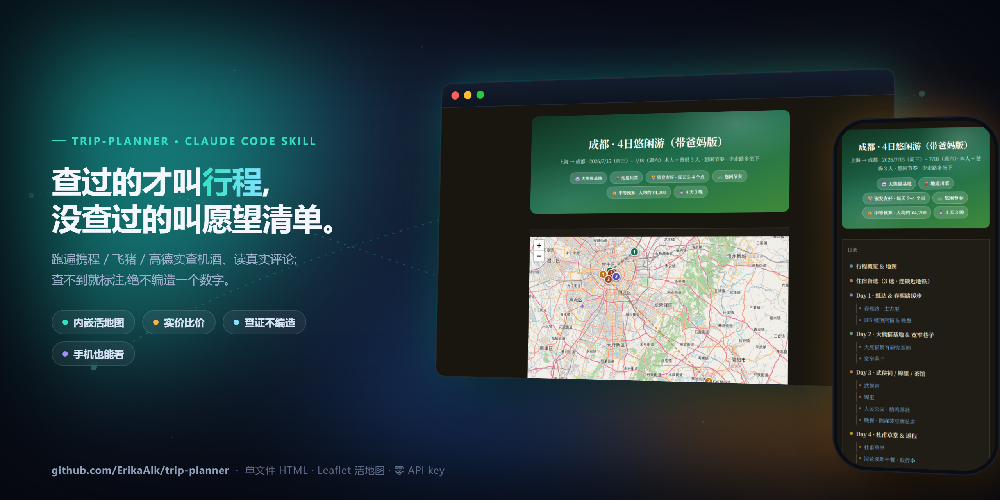
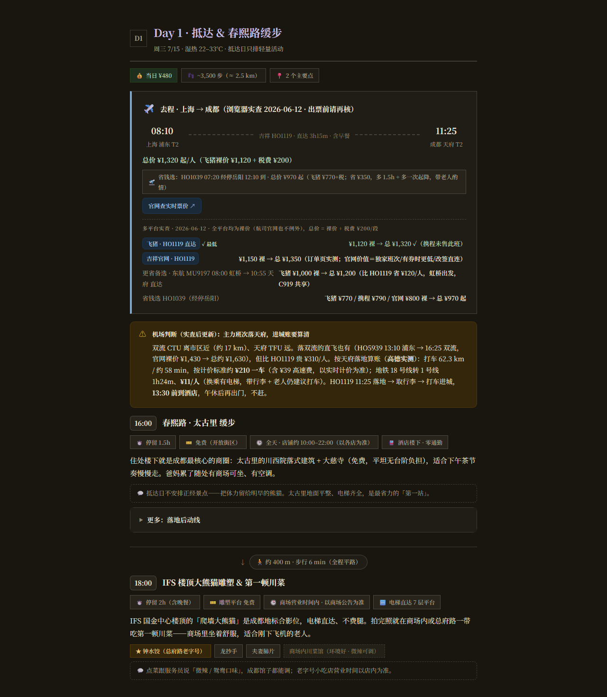
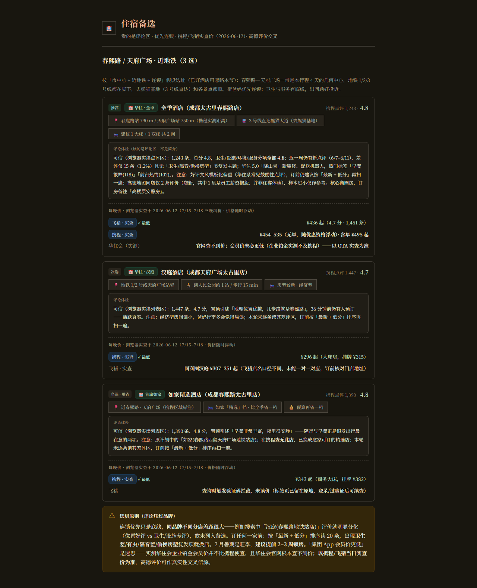
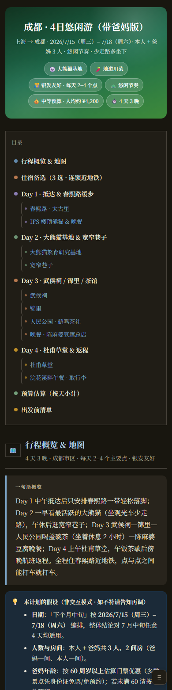

<div align="center">

# trip-planner | 查证型行程页

> *「AI 排的行程看着挺靠谱,营业时间、票价、评分却大多没查过。」*

[](SKILL.md)
[](https://skills.sh/ErikaAlk/trip-planner)
[](https://clawhub.ai/ErikaAlk/trip-planner)
[](https://claude.com/claude-code)
[](LICENSE)

**把"网上抄来的攻略"变成"查证过的行程页"——单文件 HTML,带活地图、实价比价和不撒谎的营业时间。**

[看效果](#效果示例) · [安装](#快速开始) · [触发方式](#触发方式) · [和同类有什么不同](#它和同类有什么不同) · [安全边界](#安全边界)

</div>

---


<sub>主视觉由 `scripts/make_hero.py` 用真实运行截图(`hero-desktop.png` + `mobile.png`)合成,非设计稿。完整产物见 [examples/成都4日游行程.html](examples/成都4日游行程.html)。</sub>

---

## 它解决什么问题

你让 AI 排过行程吗?它会热情地给你一篇小作文:景点是真的,营业时间是编的;路线在地图上画出来是个"米"字;机票价格停留在它的训练数据里;酒店推荐抄的是商家简介,不是住客差评。

这个 skill 换了一个思路:**行程不是写出来的,是查证出来的。** 它跑一个四段工作流——先把需求 **grill 透**(沿决策树逐层追问:大交通订了没?返程几点前必须到家?证件在不在有效期?——每问附推荐答案,问到没有一项靠猜为止),再检索交通/天气/开放时间(含小红书攻略,但会鉴别软广、只采多篇互证的经验),然后逐项核对(闭馆日、赶车缓冲、日落时间),最后才组装页面。每个数字要么来自当场检索或浏览器实价,要么老老实实标「以官网为准」。机票和酒店价格走浏览器多平台实查(只读,绝不下单);酒店评论**双信源交叉**——携程 + 高德都读一遍,携程光鲜但高德有复发吐槽就信高德;打车里程时长去高德路线实跑,不拍脑袋。

产出是**一个自包含 HTML 文件**:发给同行人就能用,旅途中手机离线打开,勾掉的清单项都记得住。

## 效果示例

**输入**(一句话,真实 eval prompt):

```text
下个月中旬带爸妈去成都玩4天,从上海出发,预算中等,想看大熊猫、吃地道川菜,
老人家走不动太多路,节奏悠闲点,帮我做个行程。
```

**输出**(同一次运行的滚动演示 + 三个截面):


| 逐日时间线 + 交通段卡 | 住宿备选(评论体检) | 手机端 |
|---|---|---|
|  |  |  |

注意截图里的细节:机票按「实查裸价 + 现查税费」口径标总价(国内全平台列表价都是裸价、无一例外,燃油附加费还随油价频繁调整——直接拿列表价做预算必然失真);推荐的两班直飞(HO1119/HO1060)**携程当日没在卖**,飞猪和官网在卖且**全是裸价**(吉祥官网页头标"含税"但订单页实测仍另加 ¥200 税费)——比价必须先统一到"裸价+税费"口径;市内打车费按**高德实测里程 × 成都出租车计价标准**估算并写明来源;查不到的数字(飞猪验证码墙后的那家)如实标「未读价」。实查还推翻了一串想当然:初稿推荐的一家如家分店在携程查无此店、「华住会会员价更低」实测是迷思、"上午没有直飞"是上一版漏读官网渠道的错误结论。这就是"查证型行程页"和"写出来的攻略"的区别。

**对照实验**(2 个中文用例,同 prompt 跑 with/without skill,[完整数据](evals/benchmark.md)):

| 配置 | 自动检查 | HTML 校验 | 地图 | 主题头 | POI 四字段卡 |
|---|---|---|---|---|---|
| **with skill** | **10/10 ×2** | 全过 | ✅ | ✅ | ✅ |
| baseline(无 skill) | 5/10 ×2 | FAIL ×2 | ❌ | ❌ | ❌ |

成本如实说:with-skill 约 2× tokens 和耗时(~10 万 tokens / 7–8 分钟)——这是真检索 + 完整结构化构建的价格。

## 快速开始

一行安装(推荐):

```bash
npx skills add ErikaAlk/trip-planner
```

或手动克隆:

```bash
git clone https://github.com/ErikaAlk/trip-planner ~/.claude/skills/trip-planner
```

装完对 Claude Code 说(可直接复制):

```text
国庆想去西安玩4天,从北京出发,帮我做个行程
```

零 API key 也能跑:地图用 Leaflet + OpenStreetMap(免 key),检索用 Agent 自带的 web search,浏览器比价在有 Chrome 连接时自动启用、没有就降级为标注过的估价。

### 可选:配一把腾讯位置服务 Key(强烈建议)

配了之后,**坐标、车程、公交票价不用再一个个手点地图网站**——一条命令批量查完,而且脚本会把查不到的点明确标成查不到,不会拿个相近的地方糊弄过去。不配也能用,只是退回浏览器逐段点。

1. **免费申请**:打开 [lbs.qq.com 控制台](https://lbs.qq.com/dev/console/application/mine) → 登录 → 应用管理 → 我的应用 → 创建应用 → 添加 Key
2. **启用 WebServiceAPI**,授权方式选「无」,或把本机公网 IP 加进白名单
   - ⚠ **别开签名校验(SK)** —— 脚本不支持,已经开了就另建一把不开签名的
3. **把 Key 放到本机**(二选一,都不进仓库):

   ```bash
   # 用户级,配一次长期有效
   echo "你的KEY" > ~/.claude/.tencent-lbs-key
   ```

   ```powershell
   # 或者只在当前终端生效
   $env:TENCENT_LBS_KEY = "你的KEY"
   ```

4. **验证**:

   ```bash
   python3 scripts/tencent_lbs.py selfcheck
   ```

   四项全绿(地点搜索 / 驾车路线 / 距离矩阵 / 误报防护)就算配好了。没配 Key 直接跑会打印申请步骤,不会报一个看不懂的错。

**额度**:个人开发者 10,000 次/日、5 次/秒([官方配额页](https://lbs.qq.com/webservice_v1/guide-quota.html)),一次行程规划大约几十次调用,够用。
**Key 不要提交进任何仓库** —— 脚本只从环境变量和上面那个文件读,本仓库不存任何 Key。

### 可选:配一把 Exa Key(补门票/开放时间/预约)

门票、开放时间、预约配额这几样,以前只能写「以官网为准」。配了 Exa 之后,`exa_facts.py` 会去找**官方页**并把**页面原文**取回来,你读了再写值。实测拿到了大熊猫基地的「限流 8.5万人次/日」「提前 14 日预订」「成人票 55 元」。

> ⚠ **Exa 按次计费,不是免费额度。** 实测 `/search` $0.007、`/contents` $0.001、`/answer` $0.005。每条命令都会打印本次花费,批量跑请带 `--budget` 设上限。

1. 申请与用量:[dashboard.exa.ai](https://dashboard.exa.ai)
2. 放 Key(二选一,都不进仓库):

   ```bash
   echo "你的KEY" > ~/.claude/.exa-key
   ```

   ```powershell
   $env:EXA_API_KEY = "你的KEY"
   ```

3. 验证(约 $0.008):

   ```bash
   python3 scripts/exa_facts.py selfcheck
   ```

**也可以装成 MCP**(全局可用,不限于本 skill),官方走 OAuth、不需要上面这把 Key:

```bash
claude mcp add --transport http exa https://mcp.exa.ai/mcp
```

装完要在交互式会话里完成一次浏览器授权。⚠ **但中文查询建议仍走本 skill 的脚本**:实测同一句中文在**未授权**的 `mcp.exa.ai` 上返回的是完全无关的维基百科词条(英文查询正常),授权后中文表现如何请自己验一次再依赖它。

> **提效小贴士(强烈建议):** 跑之前在 Chrome 里**提前登录好携程、飞猪、高德(登录后切到新版地图)、以及常用航司官网**,能显著减少中途的登录墙/验证码打断,比价和评论查得更全更快。**飞猪弹验证码的概率很高**——查飞猪时多留意,触发了就在标签页里过一下(Agent 不会替你过验证码)。

## 触发方式

- 帮我规划行程 / 做个旅行计划 / 帮我排个行程
- 6月去东京玩5天 / 国庆想去成都4天
- 下周末杭州两日游怎么安排?
- 带爸妈去厦门,节奏慢一点,帮我做攻略
- Plan a 5-day Tokyo itinerary, flying from Shanghai
- 9月23到26号去西安,顺便看下北京出发的高铁几点有车

## 它会交付什么

一个自包含 HTML 行程页,包含:主题化渐变头部(按目的地配色)、内嵌 Leaflet 地图(逐日编号 pin + 路线)、逐日 POI 时间线卡(到达时间/停留/票价/营业时间)、点间通勤连接器(步行/地铁/打车 + 距离 + 时间)、每日花费与步数估算、交通段卡(航班/车次 + 多平台比价)、**≥3 张住宿备选卡(评论体检 + 比价,用户没提酒店也会有)**、按天小计的预算表、localStorage 出发前清单、雨天 Plan B,以及 注意/必订/避雷 callout。

## 它和同类有什么不同

| 维度 | 同类常见做法 | 本 skill |
|---|---|---|
| 地图 | 无地图,或跳转链接([ycyliu](https://github.com/ycyliu/travel-planner-skill)、[SunDaysketch](https://github.com/SunDaysketch/travel-planner-skill)),或要 API key + 本地服务器([sucr233](https://github.com/sucr233/travel_planner_skills)) | 内嵌 Leaflet + OSM,免 key,单文件离线可看 |
| 价格数据 | 硬编码在 skill 里(会过期),或模型记忆 | 浏览器多平台实查;国内机票全平台均为裸价,统一按「裸价+现查税费」口径比价;查不到就标「以官网为准」,不编 |
| 酒店推荐 | 抄商家简介和评分 | 读最近差评做「评论体检」,评论压过品牌 |
| 预订 | 部分同类可直接下单 | **只查询,永不下单/登录/过验证码**——预订永远是你自己的动作 |
| 输出验证 | 无 | 静态校验器把关:地图坐标、组件齐全、自包含,缺住宿卡直接 FAIL |

## 安全边界

- **不编数字(数据诚信契约·凌驾一切)**:每个具体值——评分/票价/营业时间/车次/打车费/天气/坐标——要么本会话实查到并标来源,要么写成不含杜撰细节的 hedge(以官网为准/以高德为准/评分以App为准)。**宁可不写,绝不编。** 没浏览器读到评论区,就不写评分数字、不下「可信/已核」结论。

- **只读不订**:永不下单、付款、占座;预订链接给你,动作你来做。
- **永不碰你的凭据**:不输密码、不解验证码/滑块。遇登录墙会把标签页停在登录页、攒成一批请你登录一次,然后只做"读价"。
- 不删改你的文件,只在你指定的目录写一个 HTML。

## 文件结构

```
trip-planner/
├── SKILL.md                        # 工作流:需求采集 → 交通 → 天气/真实数据 → 编排 → 住宿 → 输出
├── references/
│   ├── design-system.md            # HTML 输出规范(脚手架/CSS/JS + 全部组件)
│   ├── research-playbook.md        # 检索/浏览器比价/选酒店方法
│   ├── scraping-method.md          # 高效抓取(JS读DOM替代截图)+各站点实测选择器模板
│   └── lessons-learned.md          # 真实翻车点登记册(L1–L7) + 持续迭代维护流程
├── scripts/
│   ├── check_html.py               # 输出静态校验(地图/坐标/住宿/预算/清单/自包含)
│   ├── tencent_lbs.py              # 腾讯位置服务:坐标(转 WGS-84)/车程/公交票价/距离矩阵
│   ├── test_tencent_lbs.py         # 上面那个的离线测试(28 项,不联网、不需要 Key)
│   ├── exa_facts.py                # Exa:找官方页取门票/开放时间/预约的原文(按次计费)
│   ├── test_exa_facts.py           # 上面那个的离线测试(26 项,不联网、不花钱)
│   └── make_showcase.sh            # 从真实产物重新生成 README 截图(可复现)
├── evals/
│   ├── evals.json                  # 3 个功能用例 + 触发/反触发测试 + 期望输出
│   └── benchmark.md                # with/without skill 对照实验数据
├── examples/成都4日游行程.html      # 一次真实运行的完整产物
└── assets/                         # README 截图(全部出自真实产物)
```

## 验证与测试

拿 [evals/evals.json](evals/evals.json) 里的 prompt 跑一遍,合格的产物应当一次通过:

```bash
py scripts/check_html.py 成都4日游行程.html   # Windows
python3 scripts/check_html.py <输出>.html      # macOS/Linux
```

校验器检查:`<div>` 平衡、Leaflet 接线、每个地图点的数字坐标、无模板残留、自包含、以及旅行组件是否真实落地(≥3 住宿卡/预算表/清单)。对照实验方法与数据见 [evals/benchmark.md](evals/benchmark.md)。

腾讯位置服务脚本另有一套离线测试,**不联网、不需要 Key**,可直接跑:

```bash
python3 scripts/test_tencent_lbs.py     # 28 项:坐标转换/相关性判定/Key 查找/限流/无硬编码密钥
python3 scripts/test_exa_facts.py       # 26 项:关键词定位/来源排序/预算闸/无硬编码密钥
```

其中三项是专门用来挡回归的:坐标转换被改成空操作会红、相关性拦截被放宽会红、源码里出现真实 Key 形状的字面量会红。联网部分由 `tencent_lbs.py selfcheck` 覆盖。

## 更新记录

- **2026-08-25 · v0.22.1** — SKILL.md 新增「中文文风：别写出 AI 腔」一节。
  - **为什么**：行程页的视觉在 v0.19 已经从「只换顶部横幅」改成整页可选方向，文字这层一直没管。
    「必订 / 避雷」那些 callout 里全是破折号和加粗短句，读起来像旅游宣传页而不是给自己看的行程。
  - **六条**：破折号别当万能连接词；加粗一段最多点一两个词；标题后面不挂解释；emoji 不做装饰
    （callout 自带的语义图标不算）；不写三连排比和升华结尾；不确定就写「未核实」。
  - **自检**：交付前把全文的 `——`、`**`、装饰性 emoji 各数一遍。要更细的清单读 `humanizer` skill。

- **2026-08-18 · v0.22** — 接入 Exa，补上契约里最后一格纯 hedge 的数据：门票 / 开放时间 / 预约配额。
  - **为什么**:这几样一直只能写「以官网为准」——官方页难找,`web_search` 给的是摘要而不是可引用的页面原文。
  - **新增 `scripts/exa_facts.py`**:`verify`(找官方页并给原文)、`fetch`(抓指定 URL,$0.001 最便宜)、`search`(可 `--site` 限定小红书/点评)、`answer`(仅用于定位来源)、`selfcheck`。
  - **它故意不做总结**。返回官方页自己的文字 + URL,由你读了再写值。实测拿到了以前写不出来的东西:大熊猫基地「限流 8.5万人次/日」「提前 14 日预订」「11月至次年2月上午票 8:00-12:00」「成人票 55 元」。
  - **`answer` 明确不算来源**:它返回 Exa 模型综合的流畅答案(实测质量不错、带 8 条引用),但那是二手的,抄进行程等于把模型总结洗成「已核实」。只用它定位候选 URL。
  - **关键词定位**:官方页开头是几百字导航菜单,而菜单里也含「开放时间」「票务服务」这些词。判据是**真事实句带数字、菜单不带**,据此过滤,实测干掉整块导航只留票务正文。
  - **中文必须走 REST + Key**:同一句中文查询,匿名 `mcp.exa.ai` 返回的是无关的维基百科**元音音标**词条,英文查询则正常。匿名 MCP 在中文上会静默退化。
  - **花钱,所以有预算闸**:实测 `/search` $0.007、`/contents` $0.001、`/answer` $0.005。每条命令都打印花费,`--budget` 在超限前拦住。
  - **顺手修了一个文档级 bug**:`--key`/`--json` 原来只挂在顶层,于是 v0.21 写进 SKILL.md 的示例 `geocode --file x --city 成都 --json` **照着跑会直接失败**。改为挂在子命令上,并加测试断言文档里的命令形式能被解析。
  - 测试 `scripts/test_exa_facts.py` 26 项(离线、不需要 Key、不花钱),5 条变异全部被抓住。

- **2026-08-18 · v0.21** — 接入腾讯位置服务 WebService API,把 Step 3.5 里"逐个去地图网站点"的活儿换成一条命令。
  - **为什么**:坐标、车程、公交票价这几样一直靠浏览器手点,慢且容易半途失败;坐标更是长期靠"知名点的已知坐标",查不到就只能降级。现在这些都有确定性来源了。
  - **新增 `scripts/tencent_lbs.py`**(标准库,无第三方依赖):`geocode` 批量取坐标、`route` 查驾车/公交/步行(带票价与过路费)、`matrix` 出距离矩阵做地理聚类、`search` 找周边、`selfcheck` 自检。
  - **坐标系是这次最关键的一个坑**:腾讯返回 **GCJ-02**,而本 skill 的地图是 Leaflet + OpenStreetMap(**WGS-84**)。直接填进去每个点都会偏——实测东方明珠差 **502 米**,正好错开一条街。脚本默认输出 WGS-84,转换算法与腾讯自家的坐标转换接口对过,往返误差 **0.00 米**。
  - **拦住了一个更隐蔽的坑**:腾讯的地点搜索对不存在的地名**不返回空**,而是返回一页无关 POI(查「这个地方根本不存在zzzqqq」,它给「富丽碧蔓汀」,坐标格式完整)。天真地取第一条,就会把小区坐标当景点写进行程,还顶着"API 实查"的名头——比模型自己编更难发现。脚本对每次查询做相关性判定,判定不相关就报 `no_relevant_match`,交回契约降级处理。
  - **实测踩出来的两条限制**:① 距离矩阵按 **N×N 个元素**计入 5 次/秒的并发额度(实测 2×2 通过、3×3 就被拒),所以矩阵改成分行请求、每次最多 4 个元素;② 矩阵和路线规划**给的数不一样**(同一段实测差 4 km / 10 分钟),所以矩阵只用于判断远近做聚类,写进行程卡片的车程必须用 `route` 单独查。
  - **受控标签**新增 `腾讯位置服务 API 实查 YYYY-MM-DD`,由脚本自动带出,纳入数据诚信契约。
  - **安装引导**见上面「快速开始」;额度为个人开发者 10,000 次/日、5 次/秒。**Key 不入库**,只从环境变量或 `~/.claude/.tencent-lbs-key` 读。

- **2026-07-31 · v0.20** — 把「百度地图逐段实查车程」升级成**不可省略的强制步骤**，并要求每个 POI 带一键导航深链。
  - **为什么**：真实运行里踩到两次同源翻车——① 某天卡片写「约 280km」，实为**走高速那条线**的里程，而卡片描述的是翻垭口＋绕湖北岸的走法，实际 385km、净车程近 6 小时，整天被排崩；② 沿用上一版的里程没重查，结果那一年该路段主线已改走新隧道、老国道多处封闭，数字和现实对不上。根因是同一个：**里程车程被当成"差不多就行"的估计值，而不是必须实查的事实**。
  - **改了什么**：进度清单新增 `Step 3.5 · 百度地图逐段实查车程 + Nominatim 取 WGS84 坐标`；Step 4 增加强制小节（四条硬规矩：不许估/不许沿用旧稿、净车程≠日程预算须 ×1.2–1.3 且两个数都写、展开导航步骤识别真实走法并与官方路况通报交叉验证、顺手取 WGS84 坐标）；受控标签表新增 `百度地图 YYYY-MM-DD 实查`。
  - **新增可复用方法**：`references/scraping-method.md` §四-5 补「百度地图 · 驾车路线」实测模板——`map.baidu.com` 是 SPA，拼 `dir/A/B` 会被打回首页，必须操作起终点输入框；给了**一次批量查 2–3 段**的 JS（再多会 30 秒超时）、多 POI 候选时点「选为起点/终点」的处理、以及从导航步骤明细识别新隧道/绕行线的技巧。
  - **导航深链**：POI 卡要给「导航搜索名 + 一键唤起链接」（高德 `uri.amap.com/marker`、百度 `api.map.baidu.com/marker`），**坐标系必须显式写 `wgs84`**——Nominatim 给的是 WGS84，不声明会被按 GCJ02/BD09 解释，偏移几百米。

- **2026-07-30 · v0.19** — 加入两套旅行文档方向（`journal` 旅行手账 / `magazine` 旅行杂志），并把 `--text3` 补到 AA。
  - **为什么**：这个 skill 其实早就有一层视觉变量——hero 的 `theme-night`/`theme-ocean`/`theme-sakura` 等 8 套渐变，按目的地气质选。但**它只管顶部横幅**，横幅底下每一份行程都是同一套暖米白卡片。等于「开头承诺了变化，正文没兑现」。同样的暖米白 ＋ 裸系统栈字体组合，正是 [claude-design-system-prompt](https://github.com/Trystan-SA/claude-design-system-prompt) `ai-slop-check` 第 9 条点名的默认 AI 味。
  - **两套方向**（写在 `<html data-theme="…">`，各配深色版；省略则保持旧观感，老行程零改动）：
    `journal` 旅行手账（思源宋体正文、**取消卡片**改发丝线、零圆角连 chip 也是方的像贴纸、780px 窄版心；慢旅行与想留作纪念的，**默认**）、
    `magazine` 旅行杂志（思源宋体 Black 大标题 44/30/21、分区间距 64px、一支洋红 #C2185B、卡片带浅投影；发给别人看的、种草贴）。
  - **两个轴，不是一个**：`theme-*` 管目的地气质，`data-theme` 管文档用途，自由组合。实测六种组合下 hero 渐变全部完好。
  - **刻意不做单色分区**（这是与 `study-notes` / `visual-report` 的关键差别）：行程的每日色轮转是**跨天的寻路线索**，还和地图上的路线颜色一一对应，压成单色会把这条线索毁掉。方向只把整套色**重新调色**统一到该方向的色温，**七天七色照旧**——已实测每个方向下每日色数都是 7。
  - **顺带修掉一个既有缺陷**：`--text3` 在 `--bg2` 卡片上**只有 3.21:1**（深色 3.01:1），低于 AA，而目录标题、地图说明、比价标题、换乘箭头都吃它。这是三个同源 skill 上的同一个 bug，`visual-report` 与 `study-notes` 已先后修掉，这边补齐；示例 `examples/成都4日游行程.html` 的内嵌 CSS 一并同步。
  - **示例与 README 全部资产一并翻新**：示例内嵌的也是旧 CSS 快照，加了 `data-theme` 也是空转。改成按模板组装出完整样式表整块替换，示例 `<html>` 设为 `data-theme="journal"`。**注意：`## Full CSS` 不是全部** —— 必需的 640px 移动端块挂在 HTML 模板的 `<style>` 里、在占位符之后，只取 Full CSS 会把它丢掉（`check_html.py` 的 mobile adaptation 直接 FAIL，实测踩到）。资产用 `make_showcase.sh` + `make_hero.py` + `make_demo_gif.py` 重出六张；`timeline-desktop.png` / `hotels-desktop.png` 的裁剪窗口不靠目测，改用浏览器实测的区块 `getBoundingClientRect` 坐标。
  - **实测**：从改后的 `design-system.md` 抽出 CSS ＋模板拼成真实行程页（hero、航班比价、时刻节点、POI 卡、换乘连接、预算表、行前清单全覆盖），**3 方向 × 明暗 2 模式 = 6 组合**，逐元素按真实计算样式 ＋ 逐层向上解析有效背景做 WCAG 扫描：**0 处未达标**（改动前 base 一栏有 6 处），横向溢出 0，无 JS 报错；`check_html.py` 对示例 `all checks passed`。

- **2026-06-20 · v0.18** — 生态对标:评估了 [anysearch-skill](https://github.com/anysearch-ai/anysearch-skill)(给 agent 用的统一搜索 API)能否进工作流,结论**不纳入**——它只能改进契约里已被降级的 web_search 层、碰不到三类强制浏览器数据(机票/酒店实时价、真实评论区),且中国主战场(携程/飞猪/高德/12306/小红书)零具名覆盖、供应商发布仅 6 周创始人匿名。完整「症状→理由→未来复评的唯一窄口子(燃油/官方静态页 extract)+六道门槛」记进 `references/lessons-learned.md` 新增的「对标观察登记册」B1。**本轮不改任何运行行为**,纯留对标记忆。

- **2026-06-16 · v0.17** — 同步 study-notes 的设计系统修复（暗色对比度 + 表格细滚动条）。
  - **暗色模式撞色修复**：暗色 `:root` 此前只覆盖 `*-light` 背景，`*-dark` 文本与基础强调色仍是亮色值 → 行程里的 chips/pills、主题头部 pills、分区标题在深色下暗底暗字（实测 teal-dark/teal-light 仅 1.46:1）。补齐暗色基础强调色 + `*-dark`，实测回到 6.8–9.9:1。设计系统与 study-notes / visual-report 同源，这是三者共有的 bug，本轮一并修。
  - **宽表格细滚动条**：预算表等宽表在窄屏横向滚动时，把刺眼的系统白滚动条换成主题化细滚动条（thumb=`--text2`、去掉 stepper 箭头），仅在真正溢出时出现。
  - **展示素材刷新**：`examples/成都4日游行程.html` 按新设计规范就地更新，README 全部截图（hero、timeline/hotels 桌面图、mobile、demo.gif）从更新后的真实产物重出——暗色模式下头部 chips、住宿/时间线卡片的标签、分区标题不再撞色。

- **2026-06-13 · v0.16** — 小红书也纳入高效抓取(`scraping-method.md` §六点五,用户补充+本轮复验):搜索列表 `.note-item` 实测取到 20–22 条带标题/作者/点赞——**这一层通常就够攻略佐证**(多篇互证 + 点赞判热度 + 标题鉴别软广)。复验发现一个真坑:**含 xsec_token 的笔记链接会被 harness 隐私防护拦**(`[BLOCKED: Cookie/query string data]`),所以**别抽 token URL 再导航,要直接点击 note 打开浮层**(token 在点击里走);笔记浮层正文/评论要 scope 到 `.note-detail-mask` 防串数据。五条反爬约束(登录态/token/浮层/防滑块/视频笔记)都写进文档。

- **2026-06-13 · v0.15** — 回答"选择器会不会过期":会。给 scraping-method.md 加「抗失效设计」(§八)——**保存的选择器只是"自检缓存",真正耐久的是"锚定内容(¥价 / HH:MM / 日期 / 航班号)而非类名"**(数据的形状稳,CSS 外壳才churn)。耐久阶梯 + 自愈四层:缓存选择器 → 探测+内容锚定通用提取(不依赖类名,附可运行模板)→ get_page_text 语义兜底 → 截图;并把 XHR/JSON 拦截列为可选"黄金耐久"路径(接口比 UI 稳)。纪律:失效是常态不是事故——选择器过期只让这次慢一点(多跑探测),绝不让数据变假(取不到就标"未读到·以官网为准",数据诚信契约照常)。SKILL.md/playbook 指明取 0 条要按 §八 自愈、别干等别放弃。

- **2026-06-13 · v0.14** — 采用用户用 Cowork 研究的**高效抓取方法**(`references/scraping-method.md`):查价/查评论优先用 `javascript_tool` 读 DOM 取结构化 JSON、不再截图认图——**省 token,且绕开高德 canvas 截图报错**(评价在 HTML 面板、地图才是 canvas,这正是 test-4/5 高德翻车的根因)。本轮实机复验三个核心模板全通过:携程机票 `.flight-box`(滤掉首个广告位)取 12 航班、高德评价 `[class*="ReviewList_reviewItem__"]` 取 30 条零截图、携程点评 `[class*="reviewSwiper_reviewSwiper-item"]` 选择器命中;CSS-modules 哈希类名一律用前缀包含匹配。方法 + 探测脚本 + 各站点模板沉淀进 references,SKILL.md/playbook 加了默认走 JS 抓取的指引。

- **2026-06-12 · v0.13** — 第五次测试(大理)全 11 项 PASS:飞猪/高德都遇真站点故障(404/504、canvas 报错),模型**老实标注没编**,飞猪闸正确放行了真墙(超时)、只拦甩锅——诚实降级这条主线闭环。补两处:① **携程机票 URL 换成用户实测的稳定格式** oneway-{dep}-{arr}?_=1&depdate=Y-M-D&cabin=Y_S_C_F(旧格式常渲染不出要手动点),记进模板表。② **小红书提为 Step 3 必做**——之前埋在 playbook 当可选项、test-5 零搜索;现在每趟必搜一次,带软广鉴别(只采多篇互证的具体经验),结果写进 poi-tip/tip。

- **2026-06-12 · v0.12** — 第四次测试(三亚)抓出三点:① **飞猪明知要查却没查**——这次把"高德评论没加载出来"和"飞猪没查"捆成一句"高德/飞猪我没核到"一起跳过了。修法:校验器新增第 10 检查——**酒店卡的飞猪必须真带价或真带墙标记,光写"订前自己比"判 FAIL**(成都如家的飞猪验证码墙合法、安全通过;test-3/4 的飞猪甩锅全 FAIL);指令补"一个源失败绝不连累另一个"。② **高德误判"不返回评论"**——实际是懒加载没等够(三亚喜来登有 1.5万 评价),playbook/Step 5 写明"点 POI 后 wait 3–5s 再读、跳北京就重搜",别太早下"没评价"结论。③ **README 加提效贴士**:提前登录携程/飞猪/高德(切新版)/航司官网显著减少打断,飞猪验证码高发要盯着;**工作流加入小红书攻略**(很有用,但鉴别软广、只采多篇独立笔记互证的具体经验)。

- **2026-06-12 · v0.11** — 第三次测试:评论双信源(携程+高德)做对了,但模型把它误读成「查两家就完事」,**把飞猪酒店价格比价整个丢了**(只剩携程单一价源)。修法:Step 5 + playbook 用一张表把两套要求掰开——**价格=携程+飞猪**(高德没房价、顶替不了),**评论=携程+高德**(飞猪顶替不了);一张合格酒店卡 = 携程(价+评)+飞猪(价)+高德(评) 三次浏览器读,查了携程+高德≠完成。不进校验器(成都如家卡的飞猪是合法验证码墙、只有携程一个真价,硬查会误伤),靠指令讲清。

- **2026-06-12 · v0.10** — 第二次实机测试通过(浏览器真连了、酒店真查了、零编造),按反馈补三处质量短板:① **评论改双信源**——携程 + 高德都要读、交叉比对,单一平台不够可信(高德 POI 评价更接近真实口碑,能露出携程光鲜好评盖掉的"旧/吵/窗户该换"等瑕疵);Step 5 写死流程。② **高德路线必须实跑**——里程/时长/过路费去高德路线规划真查并标「(高德实测)」,而不是写个"以高德为准"了事(这次就只 hedge 没实跑)。③ **URL 模板库加固 + 碰壁即记录纪律**——携程酒店 city id 用错会静默返回 0 家(补了常见城市 id 表 + "不确定先在框里输城市名");高德搜索导航后必须点搜索按钮才执行、城市要塞进 query;每次手动点击改 URL 才成功的,当场把可用格式回填模板表,保持"直接输 URL 就能用"。

- **2026-06-12 · v0.9** — **数据诚信契约 + 反编造校验(发布前实机测试抓出的致命洞)**:一次全新对话的厦门测试产物,校验器 7/7 全绿却含 **94 处编造**——酒店评分/点评数被伪造成「已核」,还蔓延到车次号、联票逐项价、轮渡时刻、厦大预约配额、打车费、步数、地址、4 个月后的假天气、甚至 14 个地图坐标。根因:无浏览器回退规则只覆盖了「价格」(标估价),没有平行规则约束「评分/评论结论/已核词」,且整个非酒店面无强制 hedge。修复(经 3 个对抗验证师傅审过):① SKILL.md 顶部新增**凌驾一切的数据诚信契约**——逐面硬规矩表(实查标来源 / 没查到只 hedge 不编)、受控「已验证」词表、「宁可不写绝不编」。② check_html.py 新增第 8–10 检查,关键是**反转逻辑**——不再「等自首才 FAIL」,改为「有评分/评论结论却无带日期实查凭据 → 直接 FAIL」,堵住「不写自首就绕过」的漏洞。回放:厦门 3 项全 FAIL、成都(真实浏览器核实版)全 PASS、零误伤。

- **2026-06-12 · v0.8** — **手机端适配**(用户实机反馈:之前手机上是裸奔的桌面布局):设计系统新增完整的 640px 断点移动块——压缩页边距与字号、交通段路线纵向堆叠(↓ 替代横向箭头线)、比价行改纵排、通勤胶囊/章节徽章放开 nowrap(此前长胶囊把整页撑到 480px+)、悬浮导航改全宽底部抽屉、防溢出加固;390px 视口 iframe 实测零水平溢出。check_html.py 新增第 7 检查:viewport meta + ≥600px 断点且 ≥10 条规则的移动块,缺了直接 FAIL(历史产物回放:旧版全部翻转为 FAIL,正确)。

- **2026-06-12 · v0.7** — Step 1 需求采集重写为 **grill 式访谈**(方法致谢 [grill-me](https://github.com/mattpocock/skills/blob/main/skills/productivity/grill-me/SKILL.md)):废除"一轮 ≤4 问收工"的克制式提问,改为**沿决策树分四层问透为止**——新增大交通是否已订、城际方式与红眼接受度、时间硬约束、证件状态、预算口径与硬上限、健康体力、行李托运、退改弹性等维度;每问必附推荐答案(嫌烦可整轮"都按推荐"),能 web_search 的绝不问用户,固定以「还有什么硬要求是我没问到的?」收口并回读确认。"直接安排"逃生门保留:全按推荐值填,假设清单原样进页面顶部 callout。

- **2026-06-12 · v0.6** — 用户用吉祥官网订单页实测推翻了 v0.4 的"官网价即含税"假设:**国内全平台(含航司官网)列表价均为裸价,无一例外**(吉祥页头虽标"含税票价总价",订单页仍是 票面 ¥1,150 + 机建燃油 ¥200 = ¥1,350)。比价口径统一为「裸价 + 现查税费」后结论反转:本例**飞猪裸价最低**(HO1119 ¥1,120 / HO1060 ¥980),官网的价值修正为"独家班次显示 + 有券更低 + 改签直连"而非含税价。预算按真实总价重算 ¥11,600 → ¥12,620(人均约 ¥4,200)。

- **2026-06-12 · v0.5** — 两条提效+防错规矩(用户反馈):① **URL 模板库**进 playbook——携程/飞猪机酒、吉祥官网、高德的实测可用 URL 模板成表,新平台每点出一次有效结果页就回头提炼 URL 进表,下次直接 navigate,省点击省 token。② **燃油附加费必须现查**——该费率随油价一年多次调价(2026-06-05 起 >800km ¥150/段 + 机建 ¥50),禁止用记忆值,折算前先 web_search 最新标准并在页面注明执行日期;示例中按旧假设(≈¥70)折算的税费已全部用现行标准重算。

- **2026-06-12 · v0.4** — 按真实用户反馈修三件事:① **平台真值表**进 playbook——可用:携程/飞猪/高德/航司官网;已废:去哪儿(下线)、美团(403)、同程艺龙(残废)、华住会官网(无价);「集团 App 会员价更低」实测为迷思,删除该说法。② **机票一律用航司官网含税总价**(OTA 裸价不含燃油/机建,直接进预算必然失真)——顺带发现两班更优直飞(HO1119/HO1060):携程当日未售、飞猪在售但加税后贵于官网含税价,行程重排、预算修正 ¥10,220 → ¥11,600。③ **市内打车费禁止拍脑袋**:一律高德路线实测里程 × 公开计价标准,并写明来源;酒店评价新增高德作为真实性交叉信源。④ 飞猪机票 web 端可用但 **URL 必须带全参数**(城市三字码+depDate,缺参报"入参校验失败"),URL 模板已沉淀进 playbook——首查误判"仅 App 可用",经用户实测纠正。同时承认 v0.3 的「上午直飞不存在」是漏读官网渠道的错误结论。

- **2026-06-12 · v0.3** — 旗舰示例升级为浏览器实查版:机票(携程+去哪儿同班次双价)、酒店(携程实价+实读点评区)全部带查询时间戳;实查纠正了三处编出来的假设——"上午直飞双流"不存在(在售直飞全落天府,行程按 HO1039/HO1058 重排)、全季店名与评分对错(4.6/3830条 → 实为 4.8/1243条)、一家如家分店查无此店(已换可订门店)。预算从 ¥8,000 修正为 ¥10,220(机票实价比估价高 47%)。读不到的价(需登录/仅 App)一律标「未核实」。
- **2026-06-12 · v0.2** — 活体审计发现 4 次真实运行里住宿备选全部静默脱落、而校验器对此失明。修法:Step 5 改为不可跳过(已订住宿走 `data-hotels="user-booked"` 显式出口),校验器新增旅行组件检查(历史产物回放 4/4 翻转、零误报),并用一次完整 eval 重跑验证修复(一次过,3 张住宿卡落地)。
- **2026-06-12 · v0.1** — 冻结基线:六步工作流 + 设计系统 + 静态校验器 + 2 用例 benchmark。

## 致谢

- 需求采集的 grill 式访谈方法源自 [mattpocock/skills 的 grill-me](https://github.com/mattpocock/skills/blob/main/skills/productivity/grill-me/SKILL.md):穷尽决策树、每问附推荐答案、能自己查的绝不问用户。
- HTML 视觉规范脱胎于同仓库的 study-notes skill。

## License

[MIT](LICENSE)

---

<div align="center">

*查过的才叫行程,没查过的叫愿望清单。*

</div>
